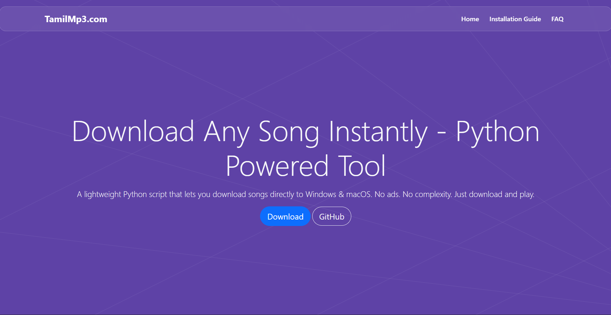

# Tamil MP3 Downloader Landing Page



Welcome to the **Tamil MP3 Downloader Landing Page** repository!  
This is a simple and elegant landing page designed for a Tamil MP3 music downloader application. The page serves as a welcoming entry for users, offering an introduction and download links for the app.

## Features

- 🎵 Attractive and responsive design
- 🎤 Highlights benefits of the MP3 downloader application
- 🌐 Built with HTML, CSS, and Bootsrap

## Preview


## Getting Started

1. **Clone the Repository**
   ```bash
   git clone https://github.com/santhosh-v11/Tamil-MP-3-downloader-Landingpage.git
   cd Tamil-MP-3-downloader-Landingpage
   ```

2. **Open the Landing Page**
   - Simply open `index.html` in your preferred web browser.

## Customization

- **Download Links:**  
  Edit the relevant sections in `index.html` to update app links.
- **Content & Branding:**  
  Replace the logo, images, or text to match your branding.
- **Preview Image:**  
  Update `assets/preview.png` for the main preview above.

## Folder Structure

```
Tamil-MP-3-downloader-Landingpage/
│
├── assets/
│   └── preview.png      # Website preview image
├── index.html           # Main landing page file
├── style.css            # Custom styles 
└── README.md            # Project readme
```

## License

This project is provided under the [MIT License](LICENSE).  
Feel free to fork, customize, and use as needed!

---

**Created by [santhosh-v11](https://github.com/santhosh-v11)**  
Happy Listening! 🎶
